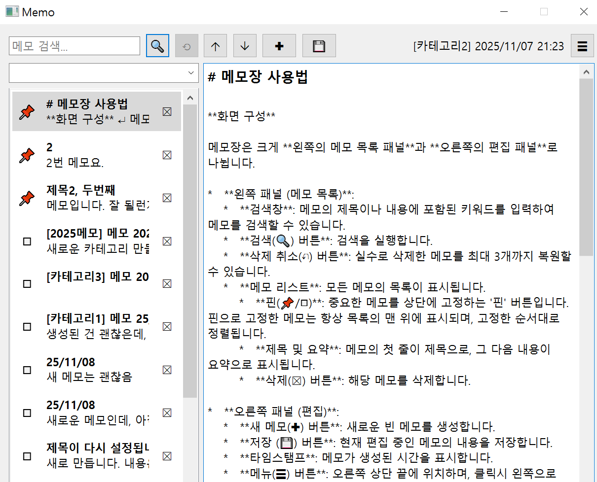

# 메모장

## 개요

* 간단 메모장. 메모 리스트 상단 카테고리 값 입력후 '새메모' 누르면 신규 카테고리 생성 기능
* entry point : memo.py

## 사용법

**화면 구성**

메모장은 크게 **왼쪽의 메모 목록 패널**과 **오른쪽의 편집 패널**로 나뉩니다.

*   **왼쪽 패널 (메모 목록)**:
    *   **검색창**: 메모의 제목이나 내용에 포함된 키워드를 입력하여 메모를 검색할 수 있습니다.
    *   **검색(🔍) 버튼**: 검색을 실행합니다.
    *   **삭제 취소(↶) 버튼**: 실수로 삭제한 메모를 최대 3개까지 복원할 수 있습니다.
    *   **메모 리스트**: 모든 메모의 목록이 표시됩니다.
        *   **핀(📌/◻︎)**: 중요한 메모를 상단에 고정하는 '핀' 버튼입니다. 핀으로 고정한 메모는 항상 목록의 맨 위에 표시되며, 고정한 순서대로 정렬됩니다.
        *   **제목 및 요약**: 메모의 첫 줄이 제목으로, 그 다음 내용이 요약으로 표시됩니다.
        *   **삭제(☒) 버튼**: 해당 메모를 삭제합니다.

*   **오른쪽 패널 (편집)**:
    *   **새 메모(🞧) 버튼**: 새로운 빈 메모를 생성합니다.
    *   **저장 (💾) 버튼**: 현재 편집 중인 메모의 내용을 저장합니다.
    *   **타임스탬프**: 메모가 생성된 시간을 표시합니다.
    *   **메뉴(☰) 버튼**: 오른쪽 상단 끝에 위치하며, 클릭시 왼쪽으로 펼쳐집니다.
        *   **About**: 앱 버전 정보를 확인할 수 있습니다.
        *   **Theme**: Light/Dark 테마를 전환하며, 선택한 테마는 저장되어 다음 실행시 자동 복원됩니다.
        *   **New Memo message**: 새 메모의 초기 텍스트 템플릿을 설정합니다.
        *   **Help**: `notepad.md` 도움말을 앱 내에서 바로 확인할 수 있습니다.
    *   **편집 영역**: 메모의 전체 내용을 보고 편집하는 공간입니다. 첫 번째 줄은 자동으로 굵고 큰 글씨의 제목 스타일이 적용됩니다.

**핵심 기능**

*   **메모 작성 및 저장**:
    1.  `새 메모(🞧)` 버튼을 눌러 새 메모를 시작합니다.
    2.  편집 영역에 내용을 입력합니다. 첫 줄은 제목이 됩니다.
    3.  `저장 (💾)` 버튼을 누르면 내용이 데이터베이스에 저장됩니다.

*   **자동 저장**:
    *   메모를 편집하던 중 왼쪽 목록에서 다른 메모를 선택하거나, 메모장 창을 닫을 때, 현재 편집 중인 내용은 **자동으로 저장**되므로 데이터가 유실될 걱정이 없습니다.

*   **중요 메모 고정 (Pinning)**:
    *   중요한 메모는 '핀(📌)' 버튼을 눌러 목록 상단에 고정할 수 있습니다.
    *   고정된 메모들은 **가장 먼저 고정한 메모가 맨 위**에 오는 순서로 정렬됩니다.
    *   고정되지 않은 일반 메모들은 가장 최근에 수정한 메모가 맨 위에 오는 순서로 정렬됩니다.

**새 메모 템플릿 설정**

*   ☰ → **New Memo message**에서 새 메모의 첫 줄을 정할 수 있습니다.
    *   **Date** 하위 메뉴: `YY/MM/DD`, `YYYY-MM-DD`, `YYYY.MM.DD` 등 다양한 포맷(2자리/4자리 연도)을 선택하면, 새 메모 생성 시 해당 날짜 문자열이 자동 입력됩니다.
    *   **String…**: 직접 문자열을 입력하여 템플릿으로 저장할 수 있습니다. 문장은 그대로 새 메모의 첫 줄로 사용됩니다.
*   선택한 템플릿은 프로그램을 다시 실행해도 설정이 유지됩니다.

**테마 변경**

*   ☰ → **Theme**에서 Light/Dark 중 하나를 선택합니다.
*   테마 역시 데이터베이스 메타데이터로 보존되며, 앱을 재시작해도 마지막으로 선택된 테마가 자동 적용됩니다.

** 실행 옵션 ** 

* `memo.py` supports the following command-line arguments:
*   `-db <path>`, `--db <path>`: Specifies the SQLite database file path. Default is `memo.db`.
*   `-scale <factor>`, `--scale <factor>`: Overrides `QT_SCALE_FACTOR` (e.g., `1.1`).
*   `-h`, `--help`: Shows the help message and exits.

---

## Guideline

### Project Structure & Module Organization
- `nemo.py`: PySide6 GUI for composing, tagging, and reordering memos; loads data at startup and persists UI state.
- `memo_db.py`: SQLite helper that bootstraps the `memos` and `notepad_state` tables, handles migrations, ordering, and category queries.
- `memo.db`: Local development database. Treat it as disposable; regenerate anytime by deleting the file and relaunching the app.
- Top-level directory has no packages; keep new modules flat unless they warrant their own folder (e.g., `services/`, `widgets/`).

### Build, Test, and Development Commands
- `pip install -r requirements.txt`: install PySide6 for the GUI
- `python nemo.py`: launch the GUI against `memo.db` in the repo root

### Coding Style & Naming Conventions
- Follow PEP 8: 4-space indentation, lower_snake_case for functions/variables, PascalCase for Qt widget subclasses, ALL_CAPS for module constants.
- Keep UI strings short; reuse emojis already in the toolbar for consistency.
- Use type hints for new public functions, and keep docstrings factual (first sentence imperative).

---